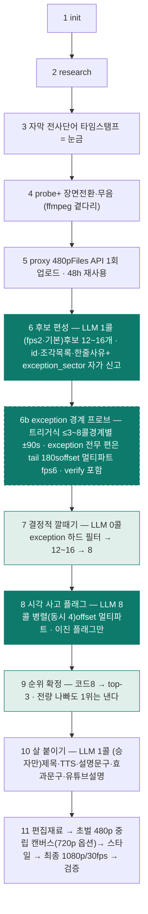

*기획서 · ai-video · 2026-09-01 · rev.7
# v4 통합 파이프라인 기획서

전체 프록시를 한 번에 이해해 후보를 여러 개 뽑고, 결정적 지표로 거른 뒤 실제 화면을 다시 보고 순위를 정해 최종 편성을 완성하는 파이프라인. 후보 채점 제안을 Gemini API 직접 실측으로 검증해 반영한 판이다.

제안 판정
방향 채택 · 수단 교체
"많이 뽑아 화면 보고 고른다"는 옳다. 다만 렌더·HIGH·절대점수 세 수단은 실측 근거로 교체한다.

비용
입력 기준 v3의 70~76%
후보 12개 + exception 프로브까지 넣어도 편당 ≈89만~98만 입력 토큰(v3 ≈129만). 출력·thinking 은 별도(§6).

fps 규칙
min(파일fps, 24, 컨텍스트)
시간은 병목이 아니다 — 지연 1~2분(콜드·긴 출력 2~3분). 기본 fps 2, 60분은 3까지 여지.

## §1이번 판에서 달라진 것
rev.2(발주 사양 충실판) 위에 후보 다중생성·시각채점 제안을 검토해 얹었다. 검토는 조사·비판·종합 9개 에이전트와 **Gemini API 직접 실측**으로 했고, 결론은 **제안의 의도는 전부 채택하되 수단 셋을 바꾸는 것**이다.
| 제안 | 판정 | 근거 한 줄 |
|---|---|---|
| ① proxy fps 1 → 2 | 채택 (메커니즘 실측 · 품질 미검증) | 60분 56.5만 토큰으로 성립. **fps 요청이 실제로 더 많은 프레임을 준다는 것은 실측으로 확정**(§2-D). 편성 품질이 좋아지는지는 미검증 — 첫 30편 fps 1 shadow 관측으로 잰다(§9-E). fps 3은 60분 소재의 상한 여지이지 기본값이 아니다. |
| ① media_resolution 기본값 사용 | 채택 (무해) | **영상에서 기본값 = LOW = MEDIUM** — 토큰 동일을 3회 독립 확인(정확도 동일은 §2-G 배터리 1회). 명시하든 안 하든 같으므로 운영자 지시대로 **기본값(미지정)**으로 간다. 단 구글이 기본값을 바꾸면 조용히 따라 움직이므로, run_log에 그 실행의 **실측 프레임당 토큰**을 남겨 변화가 드러나게 한다. |
| ① media_resolution = HIGH | 조건부·보류 | 작은 글자에서 실제 이득이 있다(한글 9~16px 창). 하지만 실전 텔롭(21px+)에는 불필요하고, 필요한 구간에서도 **크롭이 4배 싸고 4배 정확하다**(§2-H). 전체 훑기에는 컨텍스트가 허락하지도 않는다. |
| ① 프록시 720p 승격 | 기본 해상도에선 이득 0 | 토큰은 같지만 회수율이 +0.5%p(노이즈). HIGH로 갈 때만 필수가 된다 — 둘은 한 세트다(§2-G). |
| ① 전체 분석 fps 최대화 | 규칙 확정 | `min(파일fps, 24, 컨텍스트역산)`. 시간은 병목이 아니다 — 어떤 길이든 지연이 1분 근방으로 수렴한다(§2-F·§3). |
| ② 후보를 여러 개 많이 | 채택 | reranking은 LLM이 실제로 통한다고 측정된 몇 안 되는 용도. 단 '많이'가 아니라 '서로 다르게'. |
| ③ 후보를 렌더해서 재시청 | 수단 교체 | 렌더 불필요 — **offset 멀티파트로 짜집기를 그대로 보여줄 수 있다**(실측 확인). |
| ③ media_resolution = HIGH | 폐기 | HIGH의 용도는 화면 잔글씨 판독 하나. 판정 대상에 읽을 글자가 없고 비용만 4배. |
| ③ fps 5로 본다 | 채택 | 후보는 60초라 예산이 넉넉하다. 후보 8개에 17만 토큰. |
| ③ 점수를 매겨 | 관찰만 | 모델은 이진 사고 플래그만, 점수 환산은 코드가. 레포가 명문으로 금지한 자리다. |
| ④ 임계 미달 탈락 | 순위로 강등 | '최소 1편 보장'이 레포에 4중으로 깔려 있다. 절대 임계는 캘리브레이션이 안 된다. |
| ⑤ 여러 구간 짜집기 | 이미 그렇다 | v1 스토리라인·v3 비트 편성 둘 다 클립 concat이 기본형. 신규 아님. |

## §2실측으로 확정한 것
2026-09-01, `gemini-3.7-flash`, REST `generateContent`, 합성 소재(2초씩 6색 12초 + 사인파). 과금은 응답 `usageMetadata`에서 읽었다.

### 토큰 공식
```
video_tokens = round(길이초 × fps) × F  +  길이초 × 25
F = 66  (미지정 = LOW = MEDIUM)          F = 264  (HIGH)

검증: 12초 전체 @fps1 → 12×66 + 12×25 = 1,092   (실측 1,092 ✓)
      2초 1파트 @fps1 →  2×66 +  2×25 =   182   (실측   182 ✓)
      2초 3파트 @fps1 →          182 × 3 =   546   (실측   546 ✓)
```

확정 · A

### 영상에서 media_resolution 기본값은 LOW와 같다 — 상향은 아무 일도 안 일어난다
> 10초 클립의 영상 토큰: **미지정 710 · LOW 710 · MEDIUM 710 · HIGH 2,690**. 즉 "LOW를 떼고 기본값으로 올린다"는 토큰도 화질 예산도 1도 안 늘린다. 실제로 올리는 유일한 값은 HIGH이고 정확히 4배다.
> `seq_analyze.py:374`의 `MEDIA_RESOLUTION_LOW`는 **그대로 둔다**. 지우면 산출은 같은데 코드만 흔들린다(E18-4에서 무효한 변경을 되돌린 판례와 같은 규율). 발주서에서 "화질 상향" 문구만 삭제한다.

확정 · B

### offset 멀티파트 — 짜집기 후보를 렌더 없이 그대로 보여줄 수 있다
> 같은 Files API 파일을 서로 다른 `startOffset`/`endOffset`으로 한 요청에 여러 번 첨부한 실측:
| 첨부 | 기대 | 모델 응답 | 영상 토큰 |
|---|---|---|---|
| 전체 12초 | 6색 전부 | Red, Green, Blue, Yellow, Magenta, Cyan | 1,092 |
| 1파트 (4–6s) | blue | Blue | 182 |
| 3파트 (0–2, 4–6, 10–12) | red, blue, cyan | Red, Blue, Cyan ✓ | 546 |
| 3파트 역순 (10–12, 0–2, 4–6) | cyan, red, blue | Cyan, Red, Blue ✓ | 546 |

> - **모델이 모든 조각을 본다** — 색 3/3 정확.
> - **첨부 순서가 곧 편집 순서다** — 역순으로 넣으면 답도 역순. 짜집기 편성을 그대로 표현할 수 있다.
> - **과금은 조각 합계다** — 546 = 182 × 3, 오차 0.

> 후보 채점에 물리 렌더를 쓰지 않는다. 레포는 이미 같은 자리에서 `VideoMetadata(fps=…)`를 쓰고 있어(`seq_analyze.py:366` 외 3곳) **필드 두 개 추가**로 끝난다. 부수 이득으로 `refine._cut_probe_clip`의 재단·업로드·삭제 3단계도 같이 걷어낼 수 있다.

함정 · C

### countTokens로 멀티파트 예산을 잡으면 3.8배 과소 계산된다
> 같은 3파트 요청을 `countTokens`로 재면 영상 토큰이 **142**로 나온다 — 실제 과금 546의 26%다. 조각 offset이 서로 다를 때 한 파트 분량만 세고(2파트도 3파트도 똑같이 142), 조각이 *동일*하면 정상 합산된다. 프레임당 상수도 다르다(countTokens 71/32 vs 실과금 66/25).
> 예산·가드는 **반드시 `generateContent`의 `usageMetadata`**를 정본으로 삼는다. `countTokens`를 사전 예산 검사에 쓰면 컨텍스트 초과를 못 잡는다. 조사에서도 안 나온 함정이라 발주서에 명시한다.

확정 · D

### fps 요청은 실제로 반영된다 — "Files API가 1 FPS로 저장한다"는 우려는 기각됐다
> rev.3의 최대 미결을 실측으로 닫았다. 소재는 **200ms마다 서로 다른 세 자리 숫자**가 뜨는 영상이고, 숫자는 고정 시드 무작위라 모델이 수열을 추측할 수 없다. 규격은 레포 스캔 프록시와 같다(854×480 · 파일 10fps).
> **실험 ① 12초 · 60개 숫자 (연속)** — 회수량이 요청 fps에 정확히 비례한다.
| 요청 fps | 회수 | 환각 | 순서 정확도 | 입력 토큰 |
|---|---|---|---|---|
| 1 | 12 / 60 | 0 | 1.00 | 865 |
| 2 | 24 / 60 | 0 | 1.00 | 1,657 |
| 5 | **60 / 60** | 0 | 1.00 | 4,033 |

> 12 = 12초×1fps, 24 = 12초×2fps, 60 = 12초×5fps — **정확히 일치**한다. fps 5에서는 200ms만 존재하는 숫자를 하나도 빠짐없이 회수했다. 저장이 1 FPS로 제한된다면 불가능한 결과다.
> **실험 ② 431초(7.2분) · 희소 신호** — 7분 파일에서도 같다. 대부분 검은 화면이고 20곳에서 400ms만 숫자가 번쩍인다. ⚠ **검수 재확인(rev.7)**: 번쩍임은 **앞 168초 구간에만** 분포하고 뒤 263초는 전부 검은 화면이다(signalstats). "장편 전 구간에서 회수가 유지된다"는 아직 증명이 아니다 — 신호를 전 구간에 뿌린 60분·fps 2 재실험(≈565k 토큰 1회)이 §10에 남는다.
| 요청 fps | 회수 | 표본 이론 기댓값 | 환각 | 입력 토큰 |
|---|---|---|---|---|
| 1 | 12 / 20 | ≈8 (400ms ÷ 1000ms) | 0 | 28,522 |
| 2 | 16 / 20 | ≈16 (400ms ÷ 500ms) | 0 | 57,034 |
| 5 | **20 / 20** | 20 (창마다 표본 보장) | 0 | 142,438 |

> 단조 증가하고 fps 5에서 **완전 회수**한다. 입력 토큰도 431초 × 요청 fps × 66과 정확히 맞아, 프레임이 실제로 전달됐음을 과금이 이중으로 증명한다.
> **덤으로 확인된 것** — media_resolution HIGH는 이 과제에서 **회수량을 하나도 늘리지 못했다**(6조건 전부 동일한 숫자 집합). 토큰만 3.7배 든다(865 → 3,241). §4의 HIGH 폐기 판단을 실측이 뒷받침한다.
> fps 1 → 2 상향을 채택한다. ⚠ 다만 이 실험이 증명한 것은 **메커니즘**(프레임이 더 전달되고 모델이 읽는다)이지 **편집 판단의 향상**이 아니다. 실소재에서 후보 편성이 실제로 좋아지는지는 §8-3 A/B의 몫으로 남는다.

잠정 · E

### offset 판정은 실렌더와 순위가 같았다 — 다만 표본이 얇아 rev.7에서 "잠정"으로 낮춘다
> rev.3의 두 번째 미결을 닫았다. 소재는 **실제 프록시**(유미의 세포들 시즌3 · 480p · 20.5분, 파이프라인 산출물 그대로). 후보는 6초 조각 3개를 이어 붙인 18초짜리이고, 같은 후보를 **①offset 멀티파트**와 **②실제로 concat 렌더한 파일** 두 방식으로 보여 같은 질문을 던졌다. 공정을 위해 두 모드에 이음새 시각을 똑같이 알려줬다 — 남는 차이는 *경계가 구조적으로 드러나는가* 하나뿐이다.
| 라운드 | 후보 성격 | 이음새 판정 일치 | 훅 판정 일치 | 순위 일치 |
|---|---|---|---|---|
| 1차 (설계 기울기) | 매끄러움 / 중간 / 강한 튐 | 12 / 12 (100%) | 6 / 6 | ✅ 완전 일치 |
| 2차 (애매한 사례) | 같은 장소 시간차 / 애니메이션끼리 / 같은 인물 다른 장소 | 9 / 12 (75%) | 6 / 6 | ✅ 완전 일치 |
| **합계** |  | **21 / 24 (88%)** | **12 / 12** | **2라운드 모두 일치** |

> **불일치의 방향이 한결같다** — 어긋난 3건 전부 **offset 쪽이 "튐"이라고 더 세게 본 것**이다(같은 장소를 30초 간격으로 자른 후보에서 offset은 튐 2회, 실렌더는 0회). 경계가 파트로 명시되니 모델이 단절을 더 의식하는 것으로 보인다. 예상했던 방향의 편향이 실제로 관측된 셈이다.

**이 편향이 설계를 무너뜨리지 않는 이유.** 편향이 **수준(level)을 밀 뿐 순서(order)를 바꾸지 않기** 때문이다 — 모든 후보에 똑같이 걸리므로 상대 비교에서 상쇄된다. 그래서 §4에서 *절대 임계 대신 순위*로 바꾼 결정이 여기서 독립적으로 검증됐다. 만약 "튐이 하나라도 있으면 탈락" 같은 절대 게이트를 썼다면 offset은 멀쩡한 후보를 더 많이 떨어뜨렸을 것이다.

> 덧: 실렌더 쪽도 완벽한 기준이 아니다 — temperature 0인데도 후보 F에서 2회 중 1회가 뒤집혔다. 입력 토큰은 두 모드가 **정확히 같다**(3,010) — offset이 아끼는 것은 토큰이 아니라 렌더·업로드 왕복과 디스크다.

**⚠ 검수 재계산(rev.7) — 왜 "확정"이 아니라 "잠정"인가.** 2차의 "순위 완전 일치"는 offset 쪽 동점(E=F=4)을 dict 삽입 순서로 깬 *우연*이었고, 이음새 판정의 Cohen's κ는 0.44, hook_weak 는 12/12 false(분산 0 — 판별 정보 없음), 1차 원자료는 같은 파일명으로 덮여 소실됐다. §8이 요구한 κ 기준을 §2-E 자신이 지나지 못했다. **설계 결정(offset·순위 전용·top-K)은 유지**한다 — 갈려도 치명적이지 않다. 재검증 설계: 5편 × 8후보 × 2모드 × 2반복 = **160콜**(AB/BA 축은 콜당 후보 1개라 무의미 — 제거), v4 실설정(60s·fps 5)이면 ≈344만 토큰 + 사람이 설계한 후보 40개. 합격선은 *within-mode test-retest κ* 상한 대비. 그 전까지 실렌더 폴백 경로를 남기고 판정 모드를 `[seam] mode=offset|render` 로 기록한다.

> offset 멀티파트로 간다. 단 **순위 용도로만** 쓰고 절대 임계에는 쓰지 않는다(§4 임계 항목과 한 몸). 재검증은 8단계 구현과 병행.

확정 · F

### fps 상한은 셋이 정한다 — 그리고 시간은 그중에 없다
> "시간 대비 최대 fps로 분석하고 싶다"는 요구에 답하려고 셋을 쟀다.
> 1. **API 하드캡 = 24**. fps 25 이상은 `HTTP 400 FIELD_INVALID`로 요청 자체가 죽는다(직접 확인).
> 2. **파일 fps를 넘기면 순손실**. 과금은 *요청* fps를 그대로 따르는데(파일 fps로 clamp되지 않는다) 정보는 파일 fps에서 이미 포화한다. 직접 확인 — 파일 10fps 소재에 fps 24를 요청하면 **토큰 2.4배에 추가 회수 0건**.
| 요청 fps | 10 | 15 | 20 | 24 |
|---|---|---|---|---|
| 과금 배수 | 1.00× | 1.50× | 2.00× | 2.40× |
| 회수 숫자 | 60 | 60 | 60 | 60 |

> 3. **컨텍스트 예산** — 실질적으로 이것이 천장이다. `fps_max = (예산 − 25×길이초) ÷ (66×길이초)`

> **모델 인지력은 천장이 아니었다.** 표본 fps 1~24 전 구간에서 회수율 100%·환각 0·순서 완벽(26개 조건 전부). 50ms마다 값이 바뀌는 최대 난이도 소재에서 fps 20으로 400개를 전량 회수했고, 120초·19만 토큰·표본 2,880프레임에서도 열화가 없었다. 공개 벤치마크가 보고한 "5fps→8fps 꺾임"은 **재현되지 않았다.**
> **지연은 fps가 아니라 입력 토큰에 선형이고 기울기가 완만하다** — `t ≈ 8.05초 + 75.7초 × (토큰/100만)` (R²=0.973, 실측 54.7k~852k 토큰). fps 1에서 컨텍스트 상한까지 올리는 대가가 30분 소재 +45초 · 60분 소재 +36초뿐이다. **시간 예산을 따로 둘 필요가 없다.** ⚠ 단 이 회귀는 *웜 호출·짧은 출력(300~400토큰)* 조건이다 — 콜드 첫 호출은 rep1이 1.6~2.4× 느린 표본이 있고(체계적인지는 미확정), 후보 12~16개 JSON 처럼 긴 산출은 가산적으로 더 든다. 그래서 문구는 "1분 수렴"이 아니라 **"1~2분(콜드·긴 출력 2~3분)"**이다. 어느 곡선이든 타임아웃 450초 대비 3.7배 여유라 fps 규칙에 시간 항은 넣지 않는다. 별도 실험 대신 **운영 6단계 호출마다 elapsed + usageMetadata 를 run_log 에 누적**한다(운영은 늘 새 파일이라 콜드 표본이 공짜로 쌓인다) — 시간 항 부활 조건은 **콜드 p95 > 225초**.
> 규칙 하나로 끝난다 — `fps = min(파일fps, 24, (예산 − 25D) ÷ (66D))`. 조용히 clamp하지 말고 **초과 요청은 거절**한다(사람이 24fps로 분석했다고 믿으면 안 된다). 재시도는 필수 — 45회 중 1회 `503 high demand`가 났고, 같은 조건 지연이 최대 2.4배까지 흔들리므로 타임아웃은 중앙값이 아니라 최악값 기준(≥450초)으로 잡는다.

확정 · G

### 프록시 720p — 지금 설정에서는 이득이 정확히 0이다
> "토큰이 같다면 720p가 낫지 않나"는 전제부터 맞다. 토큰 공식에 해상도 항이 없고, 480p·720p·1080p가 **같은 토큰**임을 실측으로 재확인했다. 그래서 남는 질문은 "실제로 더 잘 보이느냐" 하나인데, **답이 `media_resolution`에 따라 갈린다.**
| 작은 글자 회수율 | 8px | 10px | 12px | 14px | 16px+ | 전체 |
|---|---|---|---|---|---|---|
| 480p · 기본(=LOW) ← 현행 | 0 | 2 | 21 | 79 | 100 | 50.3% |
| 720p · 기본 | 0 | 0 | 38 | 69 | 100 | 50.8% |
| 480p · HIGH | 0 | 0 | 100 | 100 | 100 | 66.7% |
| 720p · HIGH | 60 | 75 | 100 | 100 | 100 | 89.2% |
| 1080p · HIGH | 83 | 88 | 100 | 100 | 100 | 95.2% |

> **기본 해상도에서 480p→720p는 +0.5%p** — 크기별로 방향이 뒤집히는(12px +17%p인데 14px −10%p) 노이즈다. 실소재(가왕쇼 완성본) 교차 확인에서도 두 조건이 **숫자까지 완전히 같았다.** 이유는 프레임 실물로 확인됐다 — 720p 파일에는 글자가 살아 있지만, 기본 해상도의 내부 표현이 480p보다도 작아 그 정보를 *쓰지 못한다.*
> **HIGH로 올리면 뒤집힌다** — 480p→720p가 +22.5%p(8px +60%p · 10px +75%p). 즉 **480p+HIGH가 가장 나쁜 조합**이다(토큰 4배를 내고도 작은 글자를 못 읽는다). 720p의 대가는 파일 1.63배 · 업로드 +10초/10분이고 인코딩은 사실상 공짜다.
> **480p 유지.** 기본 해상도를 쓰는 한 720p는 대가만 있고 이득이 0이다. HIGH로 전환할 일이 생기면 그때는 720p가 *필수*이므로 둘을 한 세트로 묶어 기록해 둔다.

위험 · H

### 기본 해상도는 못 읽은 글자를 조용히 지어낸다
> 실험 도중 나온 부수 발견이고, 회수율보다 이쪽이 위험하다. "지어내지 마라"고 명시했는데도 기본 해상도는 빈칸을 채우려고 **평균 15개(48칸 중)를 위조**했다. 실소재에서는 사람 이름을 글자 단위로 틀렸다 — `한제호`→`한재호`, `유태환`→`유대한`. 한글 합성 실험에서도 10~13px 구간에서 **누락 0**으로 유창하게 틀렸다(`거친 종소리`→`젖은 종소리`).
> 반대로 480p+HIGH는 읽히는 것만 정확히 내놓고 **완벽하게 기권**했다(6회 전부 환각 0).
> 화면 글자 판독을 **판정 근거로 쓰지 않는다.** 후보 판정(§5-8)이 보는 것은 인물·장소·사건이지 글자가 아니므로 현 설계는 안전하다. 만약 글자를 읽어야 하면 **HIGH가 아니라 크롭**이 정답이다 — 같은 16px 한글 줄에서 *밀착 크롭+기본 = 100%/1,040토큰* vs *전체프레임+HIGH = 25%/4,224토큰*으로, 크롭이 4배 싸고 4배 정확하다(단 양축을 다 줄여야 한다 — 전폭 띠 크롭은 무효였다). 이 레포에는 이미 그 도구가 있다(`refine.py`의 정밀 재관찰).

## §3토큰 예산 표
확정 공식으로 계산. 판정선은 컨텍스트 1,048,576의 **85%(891,290)** — 프롬프트·리서치·전사 텍스트 자리를 남긴 값이다.
| 전체 훑기 설정 | 30분 | 60분 | 90분 |
|---|---|---|---|
| fps 0.5 · 기본 (v3 M1 원판) | 104,400 ✅ | 208,800 ✅ | 313,200 ✅ |
| fps 1 · 기본 (v3 현행) | 163,800 ✅ | 327,600 ✅ | 491,400 ✅ |
| **fps 2 · 기본** ← 제안 | 282,600 ✅ | 565,200 ✅ | 847,800 ✅ |
| fps 3 · 기본 | 401,400 ✅ | 802,800 ✅ | 1,204,200 ✗ |
| fps 1 · HIGH | 520,200 ✅ | 1,040,400 ✗ | ✗ |
| fps 2 · HIGH ← 제안 문자 그대로 | 995,400 ⚠ | 1,990,800 ✗ | 2,986,200 ✗ |

✅ 여유 · ⚠ 경계(85~100%) · ✗ 컨텍스트 초과 = 물리적 불가
**읽는 법**: fps 2는 60분까지 안전하고 90분에서 경계다(자동 하향 필요). **HIGH는 전체 훑기에서 어떤 조합으로도 성립하지 않는다.**
| 후보 채점 (60초 후보 · offset 멀티파트) | 후보 1개 | 후보 8개 | 후보 20개 |
|---|---|---|---|
| fps 2 · 기본 | 9,420 | 75,360 | 188,400 |
| **fps 5 · 기본** ← 권장 | 21,300 | 170,400 | 426,000 |
| fps 5 · HIGH ← 제안 문자 그대로 | 80,700 | 645,600 | 1,614,000 |

후보 채점은 예산이 넉넉하다 — **fps 5는 제안대로 살린다.** HIGH만 빼면 토큰이 정확히 1/3.8이 된다.

### 소재 길이별 권장 fps (§2-F 규칙 적용)
`fps = min(파일fps, 24, (891,290 − 25D) ÷ (66D))` — 예산은 컨텍스트의 85%. 지연은 `8.05 + 75.7 × 토큰/100만` 회귀 외삽이다.
| 소재 길이 | 컨텍스트 상한 fps | 권장 fps | 그때 토큰 | 예상 지연 | 비고 |
|---|---|---|---|---|---|
| 10분 (청크) | 22.1 | 10 | 411,000 | ≈39초 | **파일 fps가 상한** — 프록시를 더 높이면 더 올릴 수 있다 |
| 20분 | 10.6 | 10 | 842,550 | ≈72초 | 파일 fps와 컨텍스트가 거의 동시에 걸린다 |
| 30분 | 7.1 | 6 | 757,800 | ≈65초 | 여기부터 컨텍스트가 상한 |
| 60분 (표준) | 3.4 | **2** (상한 3) | 565,200 (fps 3: 802,800) | ≈51초 (fps 3: ≈69초) | **기본값은 fps 2**(§1 채택). fps 3은 예산 76.6%로 성립하는 상한 여지 — 비용 표(§6)는 fps 2 기준 |
| 90분 | 2.1 | 2 | 847,800 | ≈72초 |  |
| 120분 | 1.5 | 1 | 655,200 | ≈58초 | fps로 못 푼다 — **분할이 유일한 길** |

**지연 열이 평평한 것을 보라**(58~72초). 올릴 수 있는 만큼 올려도 시간은 1~2분 근방에 머문다(웜 호출·짧은 출력 기준 — 콜드·긴 산출은 2~3분) — 소재가 길수록 상한 fps가 낮아져 토큰이 비슷한 지점에 머물기 때문이다. **그래서 "시간 대비"를 고민할 필요 없이 컨텍스트 85%를 목표로 역산해 꽂으면 된다.**
⚠ 이 표는 **비용과 시간**만 근거로 한다. fps를 올리면 *편성 품질*이 실제로 좋아지는지는 별개이고 아직 미검증이다(§10). 그리고 10분 행이 보여주듯 **현행 프록시 파일 10fps가 짧은 소재에서 진짜 상한**이라, 더 올리려면 fps를 요청할 게 아니라 프록시를 다시 떠야 한다.

## §4왜 렌더·HIGH·점수를 바꾸는가

교체 · 렌더

### 후보 렌더는 지불할 필요가 없는 비용이다
> offset 멀티파트가 같은 것을 공짜로 해 준다(§2-B). 반대로 렌더를 하면 무는 것들:
> - 현행 `render_draft`(`stage4.py:150`)는 `-i 원본` 하나에 `[0:v]trim`을 매다는 구조라 **마지막 클립 끝까지 원본 전체를 디코드**한다. 통제 실측 trim:seek = 3.0배.
> - Files API 업로드 왕복이 후보 수만큼 늘어난다.
> - **병렬화 이득이 0이다** — 후보 4개 순차 9.86초 vs ThreadPool(4) 10.01초(speedup 0.99). libx264가 이미 전 코어를 쓴다. 맥미니 노드는 GPU 인코더도 못 쓴다(`_pick_video_encoder`가 nvenc·amf·qsv만 탐색, `h264_videotoolbox` 미포함).

**⚠ 실측 후 정정 — 렌더 비용은 위 주장만큼 비싸지 않다.** 실제 프록시로 재 보니 후보 하나를 concat 렌더하는 데 **0.3초**였다(입력 seek + 480p 프록시). 위의 "후보당 84초"는 레포의 현행 `render_draft`가 원본을 통째로 디코드하는 구조를 잰 값이고, **그 함수를 입력 seek으로 고치기만 하면 렌더는 사실상 공짜**다. 그러니 offset을 고르는 진짜 이유는 렌더 시간이 아니라 **업로드 왕복(후보당 5.1~5.8초 실측)과 디스크 누적**이다. 후보 8개면 약 46초 — 크지 않지만, 후보 편성 단계가 어차피 전체 프록시를 올려 두므로 offset 쪽은 **추가 비용이 0**이라 여전히 offset이 낫다.

> offset 멀티파트로 간다 — 판정 등가성은 §2-E에서 실측으로 확인됐다(순위 2라운드 모두 일치).

교체 · HIGH

### HIGH의 용도는 화면 잔글씨 판독 하나뿐이다
> 공식 권고 표가 직접 답을 준다 — 일반 영상 이해는 low/medium으로 충분하고, high는 **화면의 조밀한 글자(OCR)를 읽어야 할 때** 필요하다. 후보 판정 대상(480p 프록시 조각)에는 읽을 글자가 애초에 없다. 게다가 **파트별 media_resolution은 영상에서 무시된다** — 올리려면 요청 전체 설정이고 그 요청의 모든 파트가 함께 4배가 된다.
> 후보 채점에서 HIGH 폐기. 자막 잘림·글리프 누락 같은 텍스트 판정은 이미 별도 축에 있다(`finalize.py:641 frame_vision_qc` — 최종본 프레임 대상).

교체 · 점수

### 절대 점수 + 고정 임계는 이 레포가 명문으로 금지한 자리다
> `app/v3/story.py:488` 원문 — *"LLM 심사를 쓰지 않는다 — 검증자와 피검증자가 편향을 공유하면 안 된다(M9 원칙)."* 그래서 v3는 3안 중 하나를 비-LLM 루브릭(`score_story`)으로 고른다. 이미 렌더본을 다시 보는 두 경로도 **심사를 안 한다** — 최종 QC 프롬프트는 `finalize.py:636`에서 **"화면 사고만 찾아라 — 취향 평가 금지"**로 시작한다.
> 연구 수치가 그 원칙을 사후 지지한다:
| 항목 | 절대 점수 | 쌍대 비교 |
|---|---|---|
| 멀티모달 심판 vs 인간 (Pearson) | GPT-4V 0.454 · Gemini 0.262 | 0.696 · 0.616 |
| best-of-4 oracle 이득 회수율 | 21.1% | 61.2% |
| 동점률 | 59.8% | 3.9% |
| top-1 선택 시 최고점 동점 비율 | 99% — 사실상 무작위 | — |

> v4의 후보군은 **같은 소재에서 잘라낸 near-neighbor 집합** — 위 연구가 "가장 나쁜 조건"으로 지목한 형태다. 게다가 생성도 Flash, 채점도 Flash라 자기채점 편향(GPT-4 +10%p · Claude +25%p)에 그대로 노출된다.
> 모델은 **이진 사고 플래그와 근거 시각만** 답한다. 감점 환산·가중치·순위는 코드가 한다(`score_story` 확장, 순수 함수, 테스트 가능). 모델은 관찰하고 판단은 코드가 — M9 원칙이 그대로 산다.

교체 · 임계

### '최소 1편 보장'이 레포에 4중으로 깔려 있다
> `pipeline.py:3446`의 유일한 점수 게이트조차 `and len(all_storyline_variants) > 0` — **이미 하나라도 통과했을 때만** 적용된다. 그 외 `pipeline.py:3586`(커버리지 전량 탈락 시 최고 커버리지 채택) · `3598`(selected_storyline 폴백) · `v3/story.py:404`(`fallback_highlight` "최소 1개 보장").
> 무인으로 도는 노드 6대에서 전량 탈락은 **조용한 결번**이고, 스캔 토큰을 다 쓴 뒤의 재실행이라 편당 비용이 정확히 2배가 된다. 게다가 절대 임계는 캘리브레이션되지 않는다 — "7점 이상 통과"는 소재가 바뀌면 다른 뜻이 된다.
> 통과 조건을 **'점수 X 이상'이 아니라 '순위 top-K'**로. 전량이 나빠도 1위는 경고와 함께 낸다(`candidate_rank_fallback`). **절대 임계는 결정적 지표에만** 건다 — 소스 범위 위반, 발화 커버리지 0.55, 길이 초과. 그건 캘리브레이션이 필요 없는 사실이다.

## §5수정 설계 — 깔때기

**핵심 발견.** "후보가 나쁜가"를 판정하는 항목 5개 중 **3개는 화면을 안 봐도 결정적으로 계산된다.** 화면이 꼭 필요한 것은 이음새와 훅 강도 둘뿐이고, 그래서 LLM이 볼 자리가 정확히 좁혀진다.

| 판정 항목 | 어떻게 재나 | LLM 필요? |
|---|---|---|
| 죽은 시간 / 정지 화면 | 후보 구간 내 장면 전환 간 최대 간격 | ❌ 코드 |
| 발화 0 구간 | 단어 없는 최대 run + 환각 전사 배제(`plausible_speech_intervals`) | ❌ 코드 |
| 컷 중간 문장 절단 | 조각 경계가 단어·문장 중간인가 (전사 단어 경계) | ❌ 코드 |
| 조각 이음새 부자연 (인물·장소가 설명 없이 튐) | 화면을 봐야 안다 | ✅ LLM |
| 훅 강도 (첫 2초 안에 사건이 있는가 — E20-B3 과 같은 정의. `hook_max_sec` 8은 훅 *비트 길이* 상한이라 다른 양) | 화면을 봐야 안다. ⚠ seam_equiv 12/12 false(바닥 효과) — base rate 는 첫 실런 감사 기록에서 재고 판정 | ✅ LLM |
| **인트로·예고·크레딧 혼입** (가왕쇼 6화 사고 경로) | 6단계 `exception_sector` 자가 신고 → **6b 경계 프로브**(M8 방식) → 7단계 하드 필터 | ✅ LLM 관찰 + 코드 게이트 |

**⚠ "격자 단계 없음"은 "격자 재료 없음"이 아니다.** v4 3단계가 자막 전사이고 그게 눈금의 주 재료다. 장면 전환·무음은 probe 단계의 곁다리 ffmpeg 한 번이면 나온다. **별도 단계를 만들지 말고 재료만 남긴다** — 없으면 위 3줄이 전부 LLM 몫으로 넘어가고, 후보 시각을 검증할 자도 사라져 반쪽 쇼츠 5건을 낳은 그 구멍이 후보 수만큼 곱해진다.



### 8단계 프롬프트 계약 — M9를 지키는 방식
`finalize.py:636`의 QC 프롬프트와 **같은 계약**을 쓴다:
```
화면 사고만 찾아라 — 취향 평가 금지. 점수를 매기지 마라.
아래 항목에 true/false 와 근거 시각(초)만 답하라.
  · seam_jump   : 조각 이음새에서 인물·장소가 설명 없이 바뀌는가
  · hook_weak   : 첫 2초 안에 사건(대사·동작·리액션)이 없는가
```

감점 환산·가중치·순위는 코드가 한다. 동점은 낮은 인덱스(결정성).

### 6b · exception 경계 프로브 — 가왕쇼 재발 경로를 막는다 (rev.7 · 검수 B1)

Blocker · B1

### rev.6에는 예고·인트로·크레딧을 *판정하는 단계가 없었다*
> §8-3은 "exception 7편으로 회귀 0 확인"이라고 *채점*만 약속했고, 깔때기 8항목·8단계 플래그 어디에도 예고 판정이 없었다. 가왕쇼 6화 사고 경로(예고 오디오가 전사에 본편 대사처럼 섞이고 화면은 픽셀로 구분 불가)가 그대로였고, **후보를 12개 뽑으면 예고 하이라이트가 뽑힐 확률은 오히려 오른다.** 검수에서 이 구멍을 짚은 제안 3건은 기전이 틀려 기각됐지만 반박자 전원이 "구멍은 실재"라고 인정했다.
> ① 6단계 출력에 `exception_sector`(intro / teaser / credit, 원본 절대초)를 추가한다 — 출력 수십 토큰. ② **6b 경계 프로브**: M8 `refine.py` 방식을 sequences 무관 순수 함수로 분리해 재사용 — 신고된 경계마다 ±90s 창(가왕쇼 지각 49.5s가 ±30 창 밖이었던 이유), exception 전무 편은 **tail 180s** 의무 프로브, offset 멀티파트 fps 6, verify·재프로브 포함, 예산 ≤3~8콜 강제·감사. ③ 7단계 필터: **꼬리 구역(teaser·credit)은 하드**, 머리 구역(intro)은 verify 실패 시 강등. ④ 전량 탈락 시 fail-loud(조용한 예고 발행 금지). **개통 조건 = 7편 레이블 재채점 miss 0**(현 M7/M8 수치는 다른 프롬프트·0.5fps 조건이라 그대로 못 쓴다). 비용은 통상 +150~230k(§6).

### 깔때기 세부 규칙 (rev.7 · 검수 M2·M3·M5·M12·M15·M16)
- **컷 중간 절단(M2)**: 깔때기에서는 *소프트 감점*만. 승자에게만 **비대칭 스냅** — start 는 앞 ≤2.0s / 뒤 ≤0.5s, end 는 세그먼트가 경계를 가로지를 때만 뒤 ≤2.0s. 눈금은 전사 단어 경계, 부재 시 원값 유지 + 로그. dedup·길이 게이트는 스냅 *뒤*. (대칭 nearest 는 리액션 꼬리를 자른다 — E20-B1 tail_hold 규율.)
- **동점 타이브레이커(M3)**: "낮은 인덱스"는 6단계 LLM 나열 순서 = 문서화 안 된 위치 편향이 M9 뒷문으로 새는 길이다. **소스 시각순**(또는 지문 해시)으로 결정적으로 깨고 run_log 에 동점 해소 사유를 남긴다. 8단계 전량 실패 시 "순위 신호 없음"을 크게 기록.
- **정지화면 신호(M5)**: '장면전환 간격'은 대화 고정샷을 오감점할 수 있다 — 소프트 신호로 두되 **'발화 0 run' 축과 분리**해 기록(교체 금지). 리드인·꼬리 정적·서론 신호는 *기록 전용*으로 추가, `plausible` 단어 0인 조각은 null(오판 금지).
- **dedup·다양성(M15)**: 기존 `_dedup_overlapping_candidates`(단일 구간 IoU)·`select_diverse_storylines`(chunk_index·skeleton 축)는 v4 후보 형태에 맞지 않는다 — **다중구간 합집합 IoU + 소스 시각 분포 다양성**을 신규(~80줄)로 정직하게 적는다.
- **파트 상한(M12)**: 문서 10 vs 실측 25 불일치. 후보 조각 5개+·승자 10~13클립이 걸릴 수 있다 — 인접(소스 연속) 파트를 병합하고, 초과 시 **concat 렌더(입력 seek, 0.3s) 폴백** + 판정 모드 기록.
- **후보 길이 상한(M16)**: 기본 60s. E20-⓪ 이후 MAX 120s 를 쓰면 8단계 토큰이 340k 로 늘고 파트 수도 는다 — 비용 표는 60s 기준.

### 8단계·6단계 운영 규칙 (rev.7 · 검수 생존 1·2 + A·E)
- **8단계 병렬**: 8콜을 동시 4로 시작(AI Studio TPM 확인 후 8). 실측(par_probe, 48콜) 순차 78~80s → 동시 4 22~25s → 동시 8 12s, 콜당 토큰 동일, 429/503 0건. 예산 카운터는 Lock 안 check-and-increment(`refine.py:359` 식 int 는 샌다), 후보 id 정렬, 후보 단위 증분 체크포인트, 재시도 분류는 E11 규약(429·5xx·네트워크만). 편당 −55~68초 — 총 벽시계의 ~10%라 *영향은 작다*. Batch API 는 제외(동기 엔진·폴백 시 호출 2배).
- **6단계 implicit cache**: contents=[영상, 프롬프트] 순서·반려 사유 위치는 현행 그대로, 재질의는 즉시. run_log 에 `cached_content_token_count`·`cache_tokens_details` 기록. 영상 파트 implicit 적중은 실관측됨(66%). 적중 시 재질의 1회 $0.42 → $0.04. explicit 캐시는 재질의율 ≥30% 실측 뒤에만, Pro 슬롯 복귀 시 금지(저장 $4.50/M/h). ⚠ 캐시는 **요금 할인이지 컨텍스트 할인이 아니다** — 85% 예산은 promptTokenCount 로 센다.
- **usageMetadata 전 항목 기록(A)**: prompt / thoughts / candidates / cached / finish_reason 을 모든 LLM 호출의 run_log 에. `thinking_level`은 GeminiConfig 슬롯(env, 팩토리 기본 medium)으로 명시. **캡은 지금 안 건다** — 8단계 max_output 초기 4,096 · 6단계 65,536 유지, 20편 기록의 p99×2로 재설정. 예산은 달러가 아니라 가중 토큰(입력 + 5×(thoughts+candidates)), 단가는 데이터 한 곳(E13 요율 규율).
- **fps 1 shadow 관측(E)**: 첫 N≥30편에서 같은 업로드로 fps 1 후보 편성 1콜(+327,600 토큰 ≈$0.25/편)을 더 돌려 `checkpoint_candidates`에 두 후보군을 병기. 지표는 결정적(dedup 후 후보 수·7단계 생존 수·소스 커버리지). 기본값 fps 2 유지, 게이트 아님.

### 후반부 정의 (rev.7 · 검수 M13 + B)
**초벌 = 480p 중립 캔버스**(디자인 미적용, 컷 편집만). `--draft-height 720`은 사람 미리보기용 옵션이다 — §2-G대로 기본 해상도에서 720p 는 분석 이득이 0이다. **스타일 모델 입력 = 그 중립 캔버스 + 자막·TTS 띠의 y 숫자를 프롬프트로**(E18-5 회피 — v3 stage4 와 같은 전제). 코드 벨트: validate 가 자막·TTS 띠를 라벨 y 허용구간에서 제외한다(중립 캔버스에선 라벨 허용구간 0.271~0.729 가 대사 자막 자리 ≈0.69~0.73 과 ~70px 겹치는데 프롬프트·QC 누구도 못 잡는다). 합성본을 입력으로 쓰려면 N≥10 실측(ASS 기하 픽셀 계측, LLM 채점 금지) 뒤. **최종 = 1080×1920 / 30fps.** `render_draft`의 전체 디코드 구조는 입력 seek 으로 고친다(§4 정정 상자).

### 후보 편성이 "통합 1콜"을 깨는 이유
출력 상한 65,536은 thinking과 공유되고 v3 M2에서 실제로 절단이 났다. 후보 하나당 스토리·제목·TTS·문구·유튜브설명을 다 내면 후보당 2,500~4,000 출력 토큰(추정)이라 N=12에 확실히 초과다.
**후보 편성과 살 붙이기를 2콜로 쪼갠다** — 후보는 `{id, 조각 목록, 한 줄 사유}`로 얇게, 제목·TTS·문구는 **승자에게만**. v3가 3안을 한 호출에 담고도 안 터지는 이유가 정확히 이 설계다.

### '많이'가 아니라 '서로 다르게'
2초 차이로 갈리는 후보 20개는 표본이 아니라 동점 지옥이다. 현행 후보 dedup IoU 0.7(`pipeline.py:552`)을 **0.5로 조이고**, `select_diverse_storylines`(`story_builder.py:69`)의 다양성 선별을 후보 층에도 적용한다.
그리고 **후보 품질의 상한은 훑기 해상도가 정한다** — v4는 청크 정밀 분석을 없앴으므로 거친 재료에서 후보 12개를 뽑으면 12개가 전부 같은 재료의 near-neighbor다. **fps 2 상향의 진짜 정당화는 "화질"이 아니라 "후보를 여러 개 갈라 뽑을 재료"다.**

## §6깔때기 비용 (60분 소재)
| # | 단계 | 남는 수 | 판정 주체 | LLM 콜 | 입력 토큰 |
|---|---|---|---|---|---|
| 6 | 후보 편성 (fps2·기본) | → 12~16 | LLM | 1 | 565,200 |
| 7 | 결정적 깔때기 — 소스범위·전사대조·IoU 0.5·발화커버리지·길이·결속·정지화면·다양성 | → 8 | 코드 | 0 | 0 |
| 6b | exception 경계 프로브 (트리거식 · offset fps6 · verify 포함) | — | LLM 관찰 + 코드 게이트 | ≤3~8 | +150,000~230,000 |
| 8 | 시각 사고 플래그 (offset·60s·fps5·기본 · **병렬 동시 4**) | 8 | LLM 관찰 + 코드 환산 | 8 | 170,400 |
| 9 | 순위 확정 (결정적 타이브레이커) | → 순위표 top-3 보관 | 코드 | 0 | 0 |
| 10 | 살 붙이기 (승자 1편 · 교체는 `--candidate-id` 재개) | 1 | LLM | 1 | ≈5,000~15,000 |
|  | **합계 (입력 토큰 기준)** |  |  | **11~18** | **≈890,000~980,000** |

**대조**: v3 현행 편당 입력 = Stage1 365,820 + 청크 896,460 + style 25,260 = **1,287,540** (청크 값은 67분 전체 런타임을 fps 3·기본으로 본 것 — 4,020s × (3×66+25) = 896,460, 즉 청크 전수). 이 설계는 **입력 기준 v3의 70~76%**다(rev.6의 58%는 exception 프로브를 빼먹은 값). 첫 30편은 fps 1 shadow(+327,600)가 더 든다. ⚠ **이 표는 입력 토큰만이다** — 출력·thinking 단가는 입력의 5배($3.75/M vs $0.75/M, 2027-01-01부터 전 항목 2배)이고, Pro 슬롯 복귀 시 >200k 구간은 $4/M(6단계 5.3배). 그래서 6·8단계는 **Flash 슬롯 고정**이고, 달러는 첫 실호출 usageMetadata 뒤에 병기한다.
렌더 방식을 유지했다면: 후보 8개 × 렌더 + 업로드 왕복 = **+11분 이상의 벽시계**와 디스크 증가. offset 멀티파트가 이걸 전부 0으로 만든다.

## §7반드시 같이 들어가야 하는 배관
하나라도 빠지면 이 레포가 이미 겪은 사고가 재발한다.
| 항목 | 내용 | 근거 판례 |
|---|---|---|
| 후보 지문 | `sha1([후보 timeline, 채점 파라미터(fps·프롬프트 판·루브릭 가중치)])`. 파일 존재만 보면 안 된다 | M4 적대 리뷰 critical — 채점 파라미터를 지문에 안 넣으면 fps를 바꿔 재실행해도 캐시가 먹어 **조용히 무시**된다 |
| 후보 목록 고정 | `checkpoint_candidates.json` 저장, 재개는 재호출 없이 재적용 | E15 재개 계약. temperature 0이어도 편성은 흔들린다(M3 편성 교집합 7/20) |
| 예산 강제 | `CANDIDATE_JUDGE_BUDGET` — 호출 수와 누적 토큰 둘 다. 소진 시 **탈락이 아니라 '미채점'** | `refine.py:35 FLASH_BUDGET=8`의 '강제 + 감사 + 소진 시 원판정 유지' |
| 실패 3갈래 | 성공→플래그 / 실패→**미채점**(0점 아님)+⚠ / 전량 실패→결정적 루브릭만 + `scoring_unavailable` | "채점 실패→0점→탈락" 금지. 전량 빈 번역이 조용히 통과한 P4 사고와 동형 |
| 편집실 경계 | `--edit-overrides`가 있으면 **후보 단계 통째 건너뜀** | 사람 편집본은 어떤 후보의 점수도 아니다 — 재채점하면 **AI 점수가 사람 편집을 거절하는 경로**가 생긴다(2026-09-01 "편집실 제목이 AI를 이긴다"와 같은 정신) |
| 경계 벨트 | offset을 보내기 전 소스 길이와 대조 | `endOffset`이 소스를 넘어도 **오류 없이 조용히 클램프**된다 — `clips_beyond_source`와 같은 규율 |
| 예산 계산 정본 | `usageMetadata`로만. `countTokens` 금지 | §2-C — 멀티파트에서 3.8배 과소 계산 |
| 감사 기록 | `steps[{step:"candidate_rank"}]` = `{of, kept, dropped:[{id, 조각, 지표, 플래그, 순위}], budget_used}` | 떨어진 후보가 안 남으면 **within-prompt 상관을 영원히 못 잰다**. M6 조인이 이 표를 읽으면 자동 계산된다 |
| Files API 핸들 수명 (M7) | 6·6b·8·refine 이 **같은 업로드 핸들**을 공유. 삭제는 최종 렌더 성공 후(실패 시 finally). 재개 시 `files.get` 실패면 재업로드(≈50s) + `[cache] ⚠` 기록 | v3는 호출 직후 `files.delete`(`seq_analyze.py:457` 외 3곳) — rev.6의 "48h 재사용"은 **현 코드로 불성립**이었다 |
| 편집실 승계 목록 (M10) | 후보 단계를 건너뛴 재렌더가 승계하는 것: `checkpoint_candidates`·exception 구역·스냅 결과·스타일 지문. 스타일 지문 = `sha1(timeline + label_plan + 프리셋 값)`, 프롬프트 판은 provenance 에만. 사람 design·title 은 재호출 결과 위에 *마지막*으로 | rev.6엔 후보 단계 이후 승계 목록이 없었다. **v3 결함 선행 수정**: `overrides.py` HANDLED_KEYS 에 `design` 이 있으나 `apply_overrides_to_plan` 이 읽지 않아 style.json 에 안 얹힌다 — v4 착수 전 수정 + 가드(ves 어댑터가 design 을 CLI 로 따로 넘기는지는 미확인) |
| 편집실 스냅 (M11) | 사람 컷은 단어 끝 ∪ scene_cuts ∪ 무음 경계에서 **관용 0.5s 안에서만** 스냅, 초과 시 원값 유지 + snap_log | `overrides.py:32` 는 `grid.span_candidates` 없으면 ValueError — v4엔 격자가 없다 |
| 후보 교체 진입 (C) | `--candidate-id` **단독 진입**(자동 사유 승계 없음). `candidate_id` + clips/subtitles/tts 동시 지정은 즉시 실패, title/design 은 공존. story 지문에 candidate_id 포함. 재개 비용 = 살붙이기 + 스타일 25k + QC + TTS 합성 요금 | 반려 프롬프트 재주입은 6+8단계 재실행(+735k, 편당 2배). reject_note 자동 승계는 사람 사유를 버리는 조용한 대체 |
| 엔트리·로더·배포 (M9) | ① 엔트리 `python -m app.v4` ② run_log `pipeline:"v4"` 마커 ③ replay 로더(`loader.py:87-132`)에 v4 후보/승자 인식 추가(안 하면 v4 편은 "집계 0") ④ ves 어댑터 v4 분기 ⑤ auto_update 배포 순서: 엔진 전 노드 → 채널 design 키 | 구 노드에서 `app.v4` 는 ModuleNotFound — 새 CLI 플래그와 같은 롤아웃 규율 |
| 초벌 렌더 수정 (M13) | `render_draft` 를 입력 seek 구조로(0.3s), 480p 중립 캔버스 기본, `--draft-height` 옵션 | §4 정정 상자 — 현행은 원본 전체 디코드 |
| CLI 롤아웃 | 새 플래그 미지정 = 종전 동작. 채널 design 키 미러는 **전 노드 배포 뒤** | `--no-narration`·`--style-tone`이 이미 두 번 겪은 argparse 즉사 |

## §8단계적 도입 — 각 단계가 다음 단계의 근거를 만든다
1. **fps 정보 이득 실측** — 완료 (2026-09-01) 12초 연속판 12/24/60, 431초 희소판 12→16→20/20, 환각 0. fps 요청은 정확히 반영된다(§2-D). **fps 2 채택.**
2. **offset vs 실렌더 순위 등가성** — 완료 (2026-09-01) 실제 프록시·후보 6개·2라운드. 이음새 판정 21/24(88%), **순위는 2라운드 모두 완전 일치**. offset이 "튐"을 조금 더 세게 보지만 순서는 안 바뀐다(§2-E). **offset 채택 — 단 순위 전용.**
3. **선행 (rev.7)**: v3 `apply_overrides_to_plan` design 미적용 결함 수정 + 회귀 가드. replay 로더 v4 인식.
4. **후보 수 상향 + 결정적 깔때기 + 6b exception 프로브** (LLM 판정은 프로브만) — 골든 채점 + **7편 레이블 exception 재채점 miss 0 이 개통 조건**(B1).
5. **시각 사고 플래그** (offset·이진·환산은 코드).
6. **쌍대 토너먼트** — 3·4로도 순위가 안 갈릴 때만. 열기 전에 `story.py:488` 주석을 고치는 커밋을 동반할 것(**원칙을 몰래 깨지 않는다**). 상위 4개 녹아웃 + AB/BA 스왑 = 6콜·+25.6만 토큰.
7. **임계 게이트** — 마지막. 그것도 `and 통과분 ≥ 1` 조건과 함께.

**⚠ 검증 계획을 '재현성'으로 세우면 통과하고도 틀린다.** 대규모 심판 감사의 제목이 *Reliability without Validity*다 — test-retest 0.889~0.992로 매우 재현적인 심판이 동시에 위치 편향을 보인다. v3가 M1~M3에서 쓴 '결정성 프로브' 습관 그대로 후보 채점을 검증하면 무효한 결론에 도달한다. **합격 조건 셋**: ① AB/BA 스왑 일치율 ② **인간 라벨 대조** — 정답지가 이미 있다(`editor_baselines` AI↔사람 29쌍 + `golden_cuts` 사람 제작 14세그먼트) ③ raw agreement가 아니라 **Cohen's κ와 within-prompt 상관**. 결정성 프로브는 회귀 가드로만 남긴다.

**"점수"라는 단어를 하나로 쓰지 마라.** 참여 지표(조회·시청유지)와 품질 평정은 유의한 연관이 없었다는 보고가 반복된다. 세 층으로 이름을 나눈다 — ① **결함 게이트**(결정적·하드) ② **순위 신호**(소프트·절대값 금지) ③ **진실 층** = M6 youtube_studio 조인. ②가 within-prompt 상관 0.40을 못 넘으면 ②를 통째로 끈다. 그 판정 기준을 지금 발주서에 미리 적어 둔다.

## §9결정 — rev.7에서 확정 (검수 권고안 적용 · 운영자가 뒤집을 수 있다)
rev.6의 열린 결정 4건과 검수 보고 §3의 논쟁 5건(A~E)을 아래처럼 정했다. 전부 **검수 보고의 권고안**이며, 다른 선택을 하려면 해당 항목만 바꾸면 된다(설계 골격과 독립).
| 항목 | 결정 | 근거 · 대가 |
|---|---|---|
| Q1 후보를 뽑는 목적 | **1편 렌더 + 후보 순위표(top-3) 보관**. 교체는 `--candidate-id`로 살붙이기부터 재개 | 3편 동시 렌더는 E15 variant 구멍(#2·#3이 자막·라벨을 안 받음)을 먼저 메워야 해서 별건. 재개 비용 = 살붙이기 + 스타일 25k + TTS 합성(48h 초과 시 프록시 재업로드 ≈50s) |
| Q2 화면 글자 판독 | 아니오 (유지) | §2-H — 글자는 판정 근거로 쓰지 않는다. 필요 시 크롭 |
| Q3 결번 허용 | 안 된다 (유지) | top-K + `candidate_rank_fallback` |
| Q4 M9 원칙 | 닫아 둔다 (유지) | 8단계는 이진 플래그만. 쌍대 토너먼트는 정답지(후보 선호 라벨) 확보 뒤 별건 — 지금은 "동점이 기본 상태"라는 전제 자체가 코드와 맞지 않는다(루브릭은 연속값) |
| A thinking·출력 예산 | 기록 + 슬롯 명시만 지금. **캡은 20편 기록 뒤**(§5 운영 규칙) | 8콜 캡 1,024는 실측 45콜 중 25%가 절단 트랩. "운영은 high"는 오류(팩토리 기본 medium, `gemini_client.py:2645`) |
| B 스타일 입력 | **480p 중립 캔버스** + 자막 y 프롬프트 + validate 벨트(§5 후반부 정의). 720p 는 미리보기 옵션 | v3 stage4 전제와 같다. 합성본은 N≥10 실측 뒤. ⚠ rev.2의 "720p 완성형 편집 쇼츠" 문구는 이 결정으로 대체된다 — 실측(§2-G)이 근거 |
| C 편집실 후보 목록 | top-3 전원 체크포인트 저장 + `--candidate-id` 단독 진입(§7 행) | 검수 카드에 후보 노출은 ves 발주 동반 |
| D 지연 문구 | "1~2분(콜드·긴 출력 2~3분)" + run_log 누적. 시간 항 부활 조건 콜드 p95 > 225s | 별도 실험(≈1천만 토큰) 불필요 |
| E fps 2 게이트 | 게이트 기각 → **첫 30편 fps 1 shadow 관측**(§5 운영 규칙). 기본값 fps 2 | 제안된 A/B는 검정력 0(골든 14세그 = 1칸 7.1%p · 반복 분산 = fps 간 분산). 편당 fps 2 프리미엄 $0.18 vs A/B $19 |

## §10확정 아닌 것 — 인용 시 주의
| 항목 | 상태 |
|---|---|
| 토큰 공식 66/264/25 · offset 멀티파트 동작·과금 · media_resolution no-op | 직접 실측 확정 (2026-09-01, generateContent usageMetadata, 오차 0) |
| countTokens 멀티파트 과소 계산 | 직접 실측 확정 (142 vs 실제 546) |
| fps > 1이 프레임을 실제로 더 주는가 | 직접 실측 확정 — 12초판 12/24/60 · 431초판 12→16→20/20 · 환각 0. "Files API 1 FPS 저장" 우려 기각(§2-D) |
| **fps 상향이 편집 판단을 개선하는가** | 관측 계획 — 첫 N≥30편 fps 1 shadow(§9-E). 합성 숫자 회수와 실소재 편성은 다른 과제. 제안됐던 A/B 는 검정력 0 이라 기각 |
| §2-D "431초 장편에서도 같다" | 문구 정정 — 신호는 앞 168초 뿐. 전 구간 재실험(60분·fps 2 ≈565k) 1회가 남는다 |
| 통합 1콜(fps 2·480p)의 exception 경계 정확도 | 미검증 — M7/M8 수치는 다른 프롬프트·0.5fps 조건. 7편 레이블 재채점이 B1 개통 조건 |
| 실측 조건 각주 | 기록 — 실측은 thinking 미지정·temperature 0, 운영은 팩토리 medium·temperature 미전송(v3 Stage 1만 0). 회수율·토큰 공식은 thinking 무관이라 재실측 불필요 |
| offset 파트 경계의 '이음새 판정' 등가성 | 잠정 — 2차 "순위 완전 일치"는 동점(E=F=4)을 삽입 순서로 깬 우연, 이음새 κ 0.44, hook_weak 12/12 false(분산 0), 1차 원자료 소실. 재검증 160콜 설계는 §2-E |
| 렌더 상대비 "후보당 84초" | 실측으로 정정 — 입력 seek + 480p 프록시면 **0.3초**. 84초는 현행 `render_draft`의 전체 디코드 구조 탓이다(§4 정정 상자) |
| Files API 업로드 왕복 시간 | 실측 — 후보(1.2MB) 5.1~5.8초 · 원본 프록시(80MB) 49~53초 |
| 요청당 영상 파트 상한 | 불일치 — 문서 10 vs 실측 25 통과. 조각 많은 설계는 폴백 준비 |
| 렌더 실측 상대비 (trim:seek 3.0× · 병렬 speedup 0.99) | 합성 소재 — 절대 초를 맥미니로 옮기지 말 것. 신뢰할 값은 상대비 |
| fps 하드캡 24 · 파일 fps 초과 시 과금만 증가 | 직접 실측 확정 — fps 25+ HTTP 400. 10fps 파일에 24fps 요청 = 토큰 2.4배·추가 회수 0(§2-F) |
| 모델 인지력의 fps 천장 | 실측 — 1~24 전 구간 회수율 100%·환각 0(26조건). 공개 벤치마크의 "5→8fps 꺾임" 재현 안 됨 |
| 지연 = 8.05 + 75.7×(토큰/100만) | 회귀·R²0.973 (웜·짧은 출력) — 실측 54.7k~852k. 콜드 첫 호출 rep1이 1.6~2.4× 느린 표본(체계적인지 미확정), 긴 산출은 가산. 문구는 "1~2분(콜드·긴 출력 2~3분)". 운영 run_log 누적으로 판정(§9-D) |
| 720p 승격 이득(기본 해상도) | 실측 0 — 합성 +0.5%p(비단조=노이즈), 실소재는 숫자까지 동일 |
| 기본 해상도의 글자 환각 | 실측 — 48칸 중 평균 15개 위조, 실소재 인명 오독. HIGH는 기권(§2-H) |
| 후보당 출력 토큰 2,500~4,000 | 추정 — 실호출 usageMetadata로 확인 필요 |
| v4가 청크 정밀 분석을 없앤 것의 등가성 | 범위 밖·미검증 — 후보 품질의 상한을 정하는 항목이라 별도 A/B 필요 |
| LLM 심판 연구 수치 | 외삽 — 한국어 예능 쇼츠 편집 품질을 LLM이 채점한 연구는 없다. 인용 근거는 생성형 T2V 품질 또는 일반 VQA 벤치마크 |

rev.7 (2026-09-03): **검수 반영** — 6b exception 경계 프로브 신설(B1) · §2-E 잠정화 · §2-D/§2-F 문구 정정 · fps 기본 2/상한 3 통일 · §5 깔때기 세부 규칙(M2·M3·M5·M12·M15·M16) · 8단계 병렬·implicit cache·usage 기록·fps1 shadow · 후반부 정의(480p 중립 캔버스) · §6 비용 표 "입력 기준"·70~76% · §7 배관 6행 추가(M7·M9·M10·M11·C·M13) · §9 결정 A~E 확정. 검수 보고: 레포 `docs/v4/v4-plan-audit.md`. / rev.6 (2026-09-01): **해상도·fps 상한 실측 완료** — §2-F(fps 3중 제약·지연 회귀) · §2-G(720p) · §2-H(글자 환각) 신설, §3에 길이별 권장 fps 표 추가, media_resolution 기본값 채택. 4개 병렬 실험 + fps 캡·과금 직접 재확인. / rev.5: offset vs 실렌더 등가성 실측 완료 — §2-E 신설, offset 채택(순위 전용), §8-2 소진, 렌더 비용 주장 정정. 스크립트 `seam_equiv.py`. / rev.4: fps 정보 이득 실측 완료 — §2-D 신설, fps 2 채택, §8-1 소진. 스크립트 `fps_gain.py`·`fps_gain_long.py`. / rev.3: 후보 다중생성·시각채점 제안 검토 반영. 검토 방법 — 조사·비판·종합 9개 에이전트(웹 근거 + 레포 코드) + Gemini API 직접 실측 재확인. 레포 근거 6건(`story.py:488`·`STORY_CANDIDATES`·`fallback_highlight`·`QC_PROMPT`·`FLASH_BUDGET`·`render_draft`) 전수 확인 완료. rev.2의 11단계 발주 사양은 §5 깔때기가 6단계를 확장한 것 외에는 그대로다.
